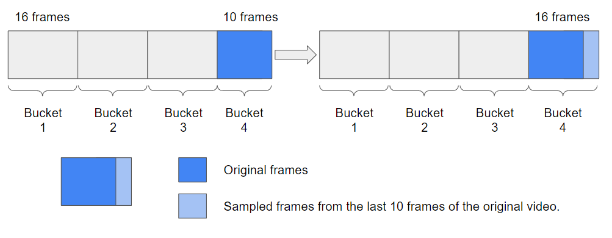

# 🎥 Features Extractor Video Classification 🎥

The following code has as main objective to obtain video-action features using pretrained models from the [PySlowFast](https://github.com/facebookresearch/SlowFast) and [TSN,TSM](https://hanlab.mit.edu/projects/tsm) framework. The code provided here focuses on obtaining features offline using the Decord library.

The logic used for the extraction of features is generating an output prior to the head of each model arranged in the framework. We obtain for each architecture a temporal component referring to each time segment.


> If you want to use the code read the "installation" and "How to use" section. For the execution of the script it is necessary to set/define in the configuration file some relevant inputs for each model.

# Methodology

Pretrained models with varying sampling rates are employed to extract features. This approach ensures that frames are iteratively processed while adhering to the frame rate of each respective model. In cases where videos possess a frame count that doesn't align with the frame rate of the models, the final bucket is populated by sampling the last frames to preserve the temporal information.



As illustrated in figure below, encoding a video introduces a change in temporal representation due to the processing in buckets of size $s$. Therefore, it is necessary to establish a mapping that enables the identification of which features correspond to natural language queries present in the datasets. We employed the mapping $\tau=(t \cdot n \cdot fps)/l$ to convert the frame/feature index to time. Specifically, an annotation starting at $t_s$ and ending at $t_e$ is converted to $\tau_s$ and $\tau_e$, representing specific positions within the features such that $\tau_s, \tau_e \in [1, \ldots, n]$.


# Installation

To install and run the current code, you must install the [pySlowFast framework](https://github.com/facebookresearch/SlowFast/blob/main/INSTALL.md). In other hand, you must install:

```
pip install scipy
pip install moviepy
pip install decord
```

Note: Sometimes `moviepy` may give some problems to execute the code, in that case please try this:

```cmd
pip uninstall moviepy
pip install moviepy
```

# How to run

To execute the code see the following instructions, in [HOWTOUSE.md](HOWTOUSE.md) you will find the execution script for each supported model (see supported models here) and in [checkpoints](#checkpoints) you will find the different models pretrained by Meta.

# Supported Models

To load weights for Resnet, SlowFast and MViT models, use the following [weights](https://github.com/facebookresearch/SlowFast/blob/main/MODEL_ZOO.md).

        Due to the size of the features, they will be uploaded as soon as possible.

| Model                       | Training Dataset       | Link                                                                                                                                |
|-----------------------------|------------------------|-------------------------------------------------------------------------------------------------------------------------------------|
| C2D NOPOOL                  | K400                   | https://dl.fbaipublicfiles.com/pyslowfast/model_zoo/kinetics400/C2D_NOPOOL_8x8_R50.pkl                                              |
| C2D_8x8_R50                 | K400                   | https://dl.fbaipublicfiles.com/pyslowfast/model_zoo/ava/pretrain/C2D_8x8_R50.pkl                                                    |
| I3D_8x8_R50                 | K400                   | https://dl.fbaipublicfiles.com/pyslowfast/model_zoo/kinetics400/I3D_8x8_R50.pkl                                                     |
| I3D_NLN_8x8_R50             | K400                   | https://dl.fbaipublicfiles.com/pyslowfast/model_zoo/kinetics400/I3D_NLN_8x8_R50.pkl                                                 |
| MVIT_B_32x3                 | K400                   | https://drive.google.com/file/d/194gJinVejq6A1FmySNKQ8vAN5-FOY-QL/view?usp=sharing                                                  |
| MVITv2_S_16x4               | K400                   | https://dl.fbaipublicfiles.com/pyslowfast/model_zoo/mvitv2/pysf_video_models/MViTv2_S_16x4_k400_f302660347.pyth                     |
| SLOW_8x8_R50                | K400                   | https://dl.fbaipublicfiles.com/pyslowfast/model_zoo/kinetics400/SLOWONLY_8x8_R50.pkl                                                |
| SLOWFAST_8x8                | K400                   | https://dl.fbaipublicfiles.com/pyslowfast/model_zoo/kinetics400/SLOWFAST_8x8_R50.pkl                                                |
| SLOWFAST_16x8_R50           | Charades               | https://dl.fbaipublicfiles.com/pyslowfast/pyslowfast/model_zoo/multigrid/model_zoo/Charades/SLOWFAST_16x8_R50.pkl                   |
| SLOWFAST_16x8_R50_multigrid | K400                   | https://dl.fbaipublicfiles.com/pyslowfast/pyslowfast/model_zoo/multigrid/model_zoo/Kinetics/SLOWFAST_8x8_R50_stepwise_multigrid.pkl |
| SLOWFAST_16x8_R101_AVA      | Something-Something V2 | https://dl.fbaipublicfiles.com/pyslowfast/pyslowfast/model_zoo/multigrid/model_zoo/SSv2/SLOWFAST_16x8_R50_multigrid.pkl             |
| X3D_M                       | K400                   | https://dl.fbaipublicfiles.com/pyslowfast/x3d_models/x3d_m.pyth                                                                     |
| X3D_S                       | K400                   | https://dl.fbaipublicfiles.com/pyslowfast/x3d_models/x3d_s.pyth                                                                     |
| rev-MViT                    | K400                   | https://dl.fbaipublicfiles.com/pyslowfast/rev/REV_MVIT_B_16x4.pyth                                                                  |